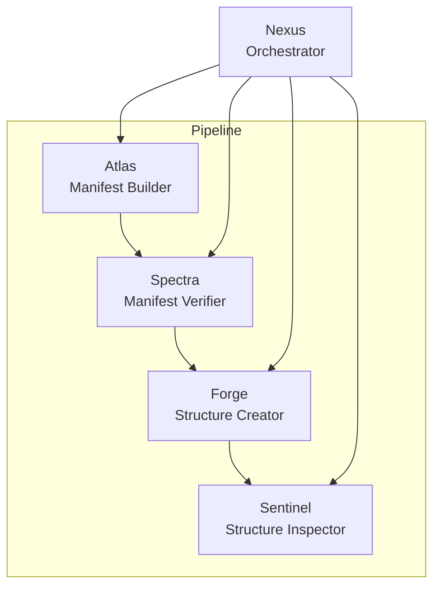

# System Blueprint

## Vision
- Build an orchestrated multi-agent system for analyzing large codebases and reconstructing them.

## Agent Roster
- **Atlas** – Manifest Builder; scans every file and directory to produce a manifest.
- **Spectra** – Manifest Verifier; checks the manifest for accuracy.
- **Forge** – Structure Creator; creates folders and empty files from the manifest.
- **Sentinel** – Structure Inspector; validates the generated structure.
- **Nexus** – Orchestrator; coordinates agents, triggers the next step, and replaces underperforming agents.

Once structure is ready, agents loop to populate code:
- Agents sequentially fill each category of files (e.g., utilities, components, index).
- Nexus ensures agents do not collide and re-queues them as they finish.

## Interface and Technology
- Single-page control panel with six chat views (five agents plus orchestrator) and a log stream.
- Uses hashed sidebar tabs; sidebar and header stay fixed while content changes.
- Built with Vercel AI SDK and shadcn UI components.
- Uses AI Gateway to access multiple models through one key.
- Backend and frontend are modular with clear folder names (`backend`, `frontend`).
- MCP server implemented in TypeScript.
